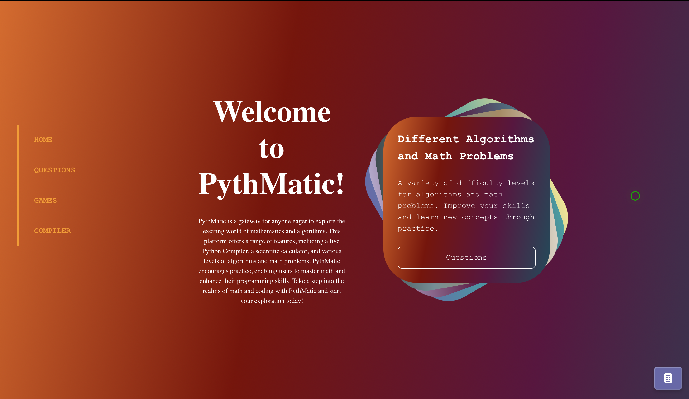
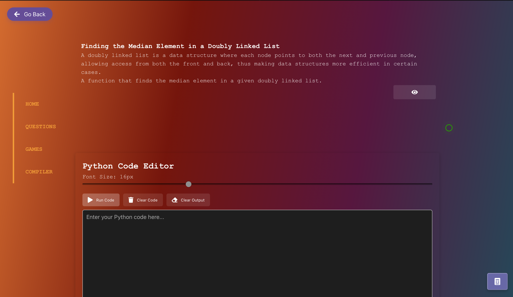
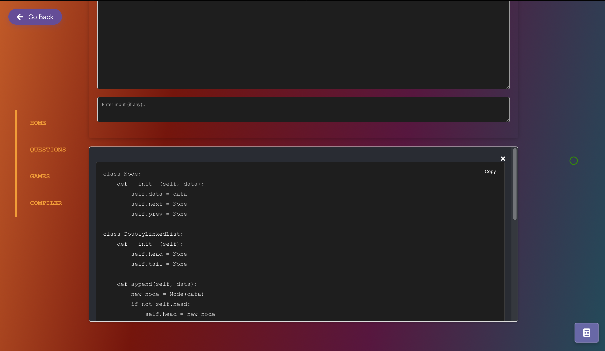
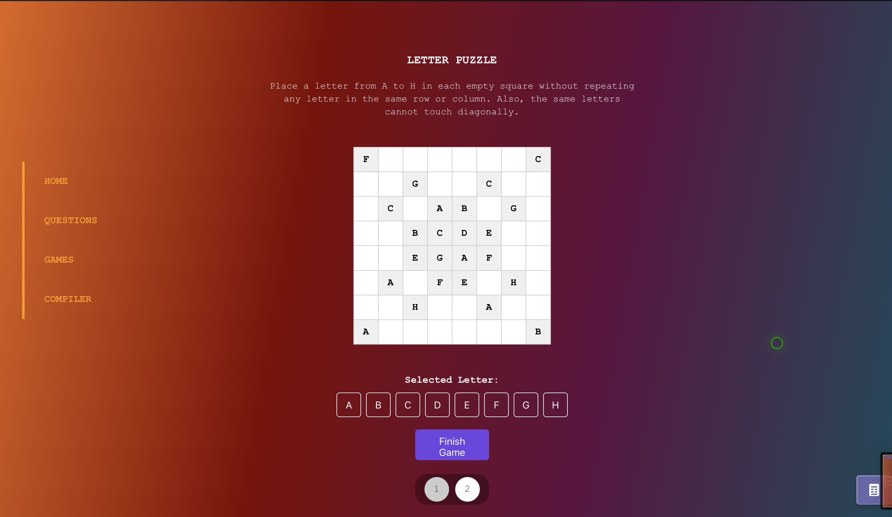

# 🧠 Pythmatic Client

A web application that makes mathematical thinking fun!  
This project offers a rich user experience enhanced with algorithmic thinking, Q&A components, a code editor, and dynamic visuals.

🔗 **Live:** [pythmatic-client.vercel.app](https://pythmatic-client.vercel.app)  
🔗 **Backend Repo:** [github.com/isinsuatay/pythmatic-backend-nodejs](https://github.com/isinsuatay/pythmatic-backend-nodejs)  
🔗 **Backend API (Render):** [pythmatic-backend-nodejs.onrender.com](https://pythmatic-backend-nodejs.onrender.com)

## 🚀 Technologies

- **Vue 3** (Composition API + Vue Router + Pinia)
- **TypeScript**
- **Monaco Editor** (VSCode-like code editor)
- **PrismJS + prism-themes** (Syntax highlighting for code blocks)
- **SCSS**
- **FontAwesome**
- **GSAP** (Animations)
- **Axios** (For API requests)
- **Vue Monaco Editor** (Monaco integration)
- **Vue Copy to Clipboard**

## 📦 Installation

To run the project locally, follow these steps:

```bash
# Clone the project
git clone https://github.com/your-username/pythmatic-client.git
cd pythmatic-client

# Install dependencies
npm install

# Start development server
npm run serve
````

The app will run on http://localhost:8080.
For backend, set the API URL in .env to: https://pythmatic-backend-nodejs.onrender.com.

## 🧱 Project Structure

├── src/
│   ├── assets/               # Images, icons, etc.
│   │   ├── screenshots/      # Screenshots
│   │   └── styles/           # Style files
│   ├── components/           # Vue components
│   ├── views/                # Page components
│   ├── router/               # Vue Router config
│   ├── store/                # Pinia stores
│   └── App.vue / main.ts     # Entry point
├── public/
├── tsconfig.json
├── vue.config.js
└── README.md

⚙️ Developer Notes
	•	SCSS support is enabled.
	•	@/ alias points to src/ directory.
	•	Custom HTML tags (<question-*>, <allquestions-*>) are supported.
	•	FontAwesome icons are globally available.


## 📸 📸 Screenshots

Home Page View:


Question Page:


Code Editor:


Game View:


## 🛠️ Backend

The backend is built with Node.js and hosted on Render.
It handles user management, questions, and answer submissions via API.
	•	Repository: pythmatic-backend-nodejs
	•	API URL: https://pythmatic-backend-nodejs.onrender.com

⸻


## 📬 Contribute

Pull requests, suggestions, and bug reports are always welcome.
Fork the repo and feel free to contribute!

⸻

Licensed under the MIT License.

🧩 Developed by [@isinsuatay](https://github.com/isinsuatay)  
🔗 Connect with me on LinkedIn: [linkedin.com/in/isinsuatay-948496299](https://www.linkedin.com/in/isinsuatay-948496299/)

